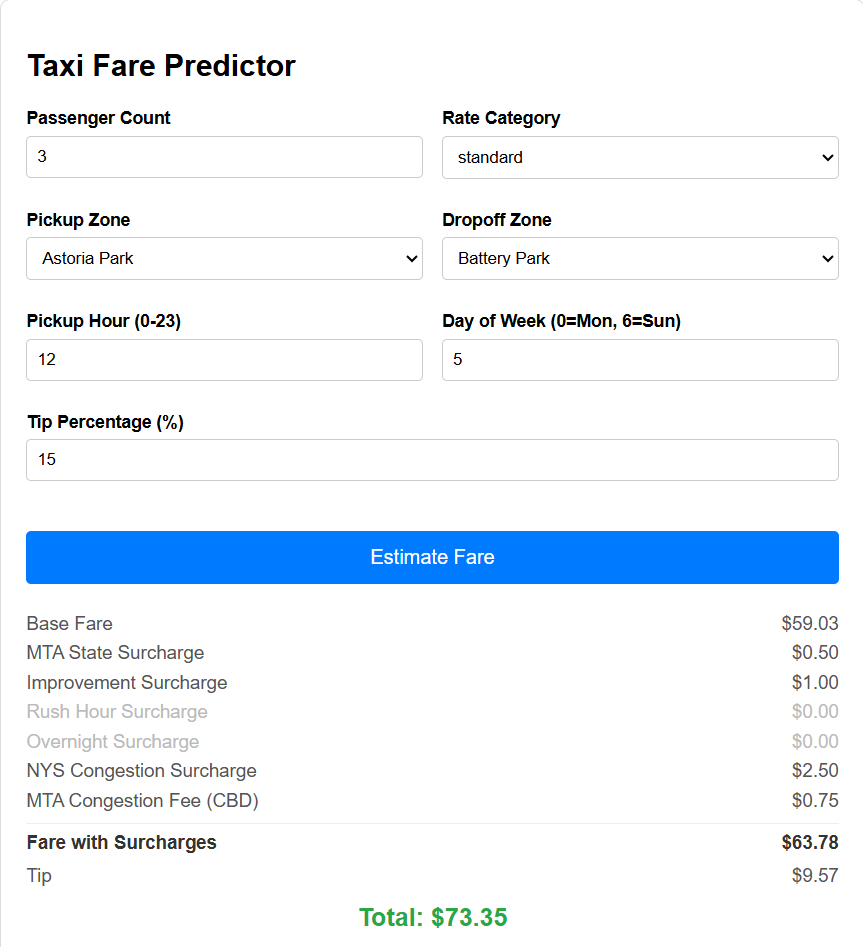
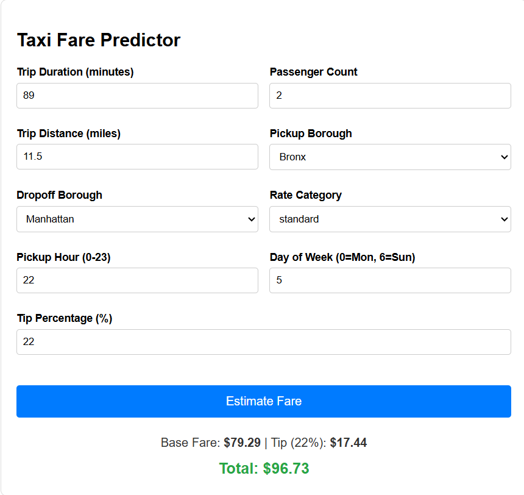

# NYC Taxi Fare Predictor


Predicts the fare of a NYC taxi trip from just a pickup zone, dropoff zone, passenger count and pickup time — no trip distance or duration required, including a full breakdown of NYC taxi surcharges on top of the model's predicted base fare.

Raw data: [NYC TLC Trip Record Data](https://www.nyc.gov/site/tlc/about/tlc-trip-record-data.page)

## Results

The metrics for the candidate models to be used in production. The linear regression was used as an initial baseline to compare the more complex models. The XGBoost and Random Forest models were tuned with randomised cross-validation serach across a parameter grid. All training runs were logging with MlFlow.

| Model | R² | RMSE |
|---|---|---|
| Linear Regression | 0.914 | 4.874 |
| Random Forest (tuned) | 0.971 | 2.819 |
| **XGBoost (tuned)** | **0.982** | **2.209** |

XGBoost was selected as the production model — despite similar training RMSE to Random Forest, it showed lower test RMSE, indicating better generalisation to unseen data. See `notebooks/model_comparison.ipynb` for the full comparison. The chosen model was promoted to 'production' in MlFlow so the trained model can be loaded in the future.

## How It Works

```
raw trip data
      │
      ▼
cleaning (src/cleaning.py)
      │
      ▼
feature engineering (src/features.py)
  trip_duration · pickup_hour/dayofweek · rate_category · is_airport_trip
      │
      ▼
zone lookup tables (src/features.py)
  mean trip distance/duration per PU→DO zone pair, 5-stage fallback chain
      │
      ▼
XGBoost model (tracked & served via MLflow)
      │
      ▼
predicted base fare
      │
      ▼
+ NYC surcharges (src/predict.py)
  MTA state · improvement · rush hour · overnight · NYS congestion · CBD fee
      │
      ▼
final fare estimate (+ optional tip)
```

## Demo

| Final version with surcharges |
|---|
| |

| First version | With tip feature |
|---|---|
|  |  | 

## Key Design Decisions

**Cold-start problem for trip distance/duration at inference time.** The model was trained on real per-trip `trip_distance`/`trip_duration`, but a user requesting a fare estimate only knows their pickup and dropoff zones — not the trip's real distance or duration. Solved this by building a pair of 256×256 PU×DO zone matrices (mean historical distance and duration between every zone pair), looked up by zone ID at prediction time in place of the missing real values.

Since not every one of the ~65,000 possible zone pairs appears in the historical data, the matrices are built via a 5-stage fallback chain (`src/features.py`), restricted to the training period only (via `time_sorted_split_df()`) to avoid leaking test-period trips into the lookup values:

1. `create_zone_matrix()` — direct mean of the value per PU/DO zone pair
2. `transpose_fillna()` — missing A→B filled from observed B→A (distance/duration between two fixed points is roughly symmetric)
3. `intra_zone_fillna()` — same-zone (PU == DO) trips filled with a fixed default (0.8 miles / 8.0 minutes), since there's no reverse trip to borrow from
4. `borough_mean_fillna()` — remaining gaps filled from the mean value for that pair's boroughs
5. any final gaps filled with the global mean across the whole matrix

```python
from features import time_sorted_split_df, build_zone_lookup

df_train, df_test = time_sorted_split_df(df, sort_index='tpep_pickup_datetime', test_proportion=0.2)

distance_lookup = build_zone_lookup(df_train, value_col='trip_distance')
duration_lookup = build_zone_lookup(df_train, value_col='trip_duration')
```

**Layering rule-based fare structure on top of the ML prediction.** Rather than asking the model to learn NYC's surcharge rules from data, `calculate_surcharges()` (`src/predict.py`) applies them deterministically per TLC's published rules — flat surcharges (MTA state, improvement), time-based surcharges (rush hour, overnight), and congestion-related fees (NYS Congestion Surcharge for Manhattan-related trips, and the MTA Congestion/CBD fee using an exact, data-derived list of CBD zone IDs). This keeps the model focused on predicting the base metered fare, and keeps the surcharge logic auditable and easy to update if TLC rates change.

```python
from predict import predict_fare

predict_fare(
    passenger_count=2,
    pickup_zone='JFK Airport',
    dropoff_zone='Midtown Center',
    rate_category='standard',
    pickup_hour=14,
    pickup_dayofweek=2
)
```

Returns a dictionary with the model's predicted base fare, an itemised surcharge breakdown, and the total. An optional tip can be added on top via `optional_tip(fare, tip_percentage)`.

**Known limitation:** because the model was trained on real, noisy per-trip distance/duration but predicts from smoothed zone-pair averages, there's a train/inference distribution mismatch — real-world accuracy is expected to be somewhat lower than the training/test metrics above, which were computed on real trip data.

## Project Structure

```
TAXI-FARE-PREDICTOR/
├── data/                     # Raw datasets (CSV, Parquet)
│   ├── taxi_zone_lookup.csv
│   ├── distance_lookup.csv
│   ├── duration_lookup.csv
│   ├── model_training_columns.json
│   └── yellow_tripdata_2026-01.parquet
│
├── Graphs/                   # Saved model performance plots
│   ├── Initial_R2_by_Model.png
│   ├── Initial_RMSE_by_Model.png
│   ├── XGB_RF_R2.png
│   └── XGB_RF_RMSE.png
│
├── notebooks/                # Jupyter notebooks for EDA & model comparison
│   ├── eda.ipynb
│   └── model_comparison.ipynb
│
├── src/                      # Source code for data processing & training
│   ├── cleaning.py           # Data cleaning utilities
│   ├── features.py           # Feature engineering & zone lookup tables
│   ├── pipeline.py           # ML pipeline construction
│   ├── predict.py            # Inference & surcharge calculation
│   └── train_and_tune.py     # Model training & hyperparameter tuning
│
├── tests/                    # Unit tests for project modules
│   ├── test_cleaning.py
│   ├── test_features.py
│   └── test_train.py
│
├── mlflow.db                 # Local MLflow tracking database
├── README.md
├── requirements.txt
└── .gitignore
```

## Setup

```bash
git clone https://github.com/Calum1888/taxi-fare-predictor.git
cd taxi-fare-predictor
pip install -r requirements.txt
```

## Background & Process

<details>
<summary>Full EDA, training, and tuning walkthrough</summary>

### EDA and Feature Engineering (`notebooks/eda.ipynb`)

Exploratory data analysis on the taxi trip dataset, analysing distributions of features such as fare amount, trip distance and duration of trips.

`src/cleaning.py` contains `load_and_clean()`, which takes the file paths for trip data and taxi zone codes and creates an SQL query that filters data based on criteria decided during EDA.

`src/features.py` performs feature engineering, including trip duration, pickup hour/day of week, and flags for flat-rate airport trips to JFK and Newark.

### Initial Training (`notebooks/model_comparison.ipynb`)

Training classes and methods (`src/train_and_tune.py`) allow an initial training run for any model, plus a randomised cross-validation search to tune hyperparameters.

Linear Regression, XGBoost, and Random Forest models were trained and compared on RMSE and R².


XGBoost was the best-performing model of the three, with the highest R² and lowest RMSE.

### Hyperparameter Tuning

XGBoost and Random Forest were tuned using `RandomisedCVSearch` over a grid of parameters.


XGBoost was chosen as the production model — despite similar training RMSE, it showed significantly lower test RMSE than Random Forest, indicating better generalisation.

### Change in Modelling Approach: Area IDs

The initial models encoded pickup/dropoff locations as one of NYC's five boroughs. This made encoding simple but limited real-world usability — the model couldn't distinguish between a 100-metre trip and one across the length of Manhattan, and users don't know their trip distance/duration in advance anyway. This motivated the zone lookup tables described above.

</details>

## Future Work

- Build a full API/pipeline where users can input pickup/dropoff location and get an accurate fare quote
- Track experiments with MLflow throughout
- Expand test coverage