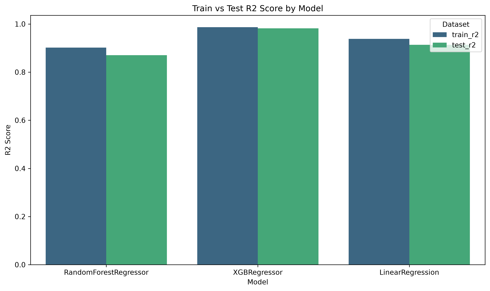
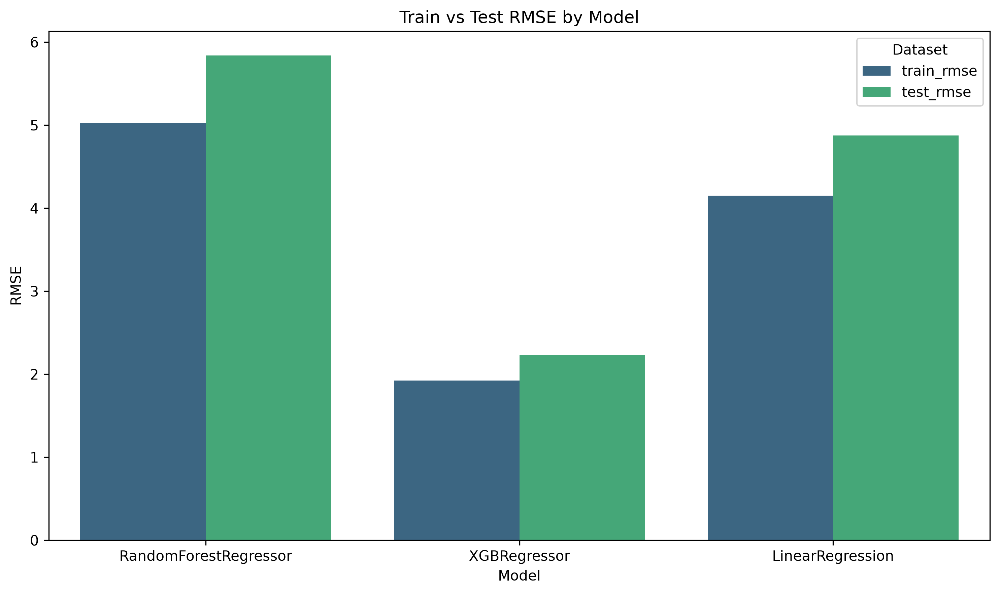

# NYC Taxi Fare Predictor

## Description

This project aims to predict the fare of a taxi trip in NYC based of historic taxi data.

## Work done so far

### EDA and Feature Engineering

So far in this project, I have conducted explorotory data analysis on the taxi trip dataset, analysing distributions of features such as fare amount, trip distance and duration of trips.

A data loading and cleaning file (`src/cleaning.py`) contains a function `load_and_clean()` which takes the file paths for trip data and taxi zone codes and creates an SQL query that filters data based on the criteria which was decided in the EDA.

I have performed feature engineering (`src/features.py`) which includes calculating the duration of trips, the hour and day of pickups, as well as flagging airport trips to JFK and Newark which are flat rates. Columns that need to be scaled will also be treated accordingly.

### Training

Training classes and methods have been created which allows for an initial training run for any model as well as a training run for a randomised cross validation search to tune the hyperparamters of the model.

Initial training runs of linear regression, XGBoost regressor and Random Forest regressor models have been conducted and their root mean squared error (RMSE) and R2 score have been computed in order to compare the performance of the models. The following graphs compare the models.


**Figure 1:** R2 comparison across models.


**Figure 1:** RMSE comparison across models.

Clearly, XGBoost is the best performing model out of the three with the highest R2 score and lowest RMSE. We will see if this trend carries over after hyperparameter tuning.

## Project Structure 
```
TAXI-FARE-PREDICTOR/
├── data/                     # Raw datasets (CSV, Parquet)
│   ├── taxi_zone_lookup.csv
│   └── yellow_tripdata_2026-01.parquet
│
├── Graphs/                   # Saved model performance plots
│   ├── Initial_R2_by_Model.png
│   └── Initial_RMSE_by_Model.png
│
├── notebooks/                # Jupyter notebooks for EDA & model comparison
│   ├── eda.ipynb
│   └── model_comparison.ipynb
│
├── src/                      # Source code for data processing & training
│   ├── cleaning.py           # Data cleaning utilities
│   ├── features.py           # Feature engineering
│   ├── pipeline.py           # ML pipeline construction
│   └── train_and_tune.py     # Model training & hyperparameter tuning
│
├── tests/                    # Unit tests for project modules
│   ├── test_cleaning.py
│   ├── test_features.py
│   └── test_train.py
│
├── mlflow.db                 # Local MLflow tracking database
├── README.md                 # Project documentation
├── requirements.txt          # Python dependencies
└── .gitignore                # Git ignore rules
```

## Future work

The next step is to tune the hyperparamters and settle in a final model to build the production pipeline around. The experiments will be tracked with MLflow and the aim is to produce a full API/pipeline where users can input their loaction, destination etc and get an accurate quote of the fare. 

Tests and documentation will also be provided throughout.